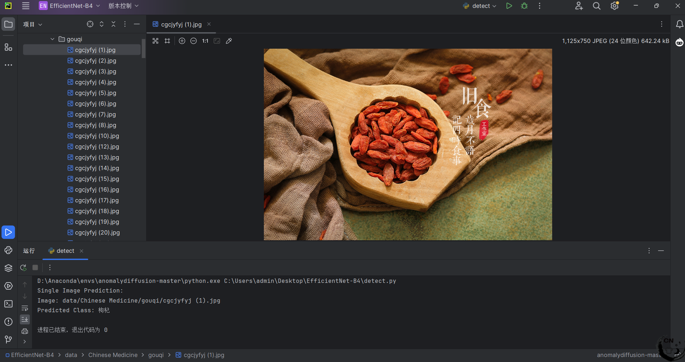
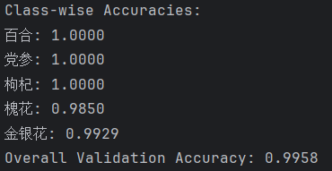

---

---

# EfficientNet-B4：图像分类模型

# 1. 模型简介

- EfficientNet-B4 是 EfficientNet 系列中的一款变体，具有更高的精度和更好的性能。EfficientNet 系列使用了复合缩放（compound scaling）方法，通过同时缩放网络的深度、宽度和分辨率来平衡计算效率与准确度。EfficientNet-B4 作为一种优化过的卷积神经网络架构，可以显著提高图像分类任务的效率和准确度，特别适用于中药材识别等应用。

  **1. EfficientNet 的优势：**

  - **高效的计算资源使用**：通过复合缩放，EfficientNet 更加高效地使用计算资源，获得比传统网络更好的性能。
  - **精度与速度平衡**：在相同的计算预算下，EfficientNet 能提供更高的准确度和更快的推理速度。
  - **良好的泛化能力**：EfficientNet-B4 在大规模数据集上的训练表现出色，能够有效提升模型在小样本数据上的泛化能力。


## 1.1 效果展示


通过使用 EfficientNet-B4 模型进行训练和优化，模型能够准确分类中药材数据集中的5分类。

## 1.2 文件结构

```shell
EfficientNet-B4/
├── data/
│   ├── chinese_medicines/        # 数据集
│   	├── train/                  # 训练集标注
│   	├── val/                    # 验证集标注  
│   	├── test/                   # 测试集标注
├── weights/               # 存放模型权重
├── cfgs.py             # 参数配置
├── models.py            # 模型定义
├── dataset.py           # 数据处理脚本
├── train.py             # 模型训练脚本
├── requirements.txt     # 依赖包
├── predict.py           # 模型预测脚本
├── test.py              # 测试集上模型检测
├── README.md            # 项目介绍
└── docs/                # 项目文档及样例图片
```

该项目结构包含数据集、模型定义、训练、测试和预测脚本，提供了从数据处理到模型评估和预测的完整工作流程。

## 1.3 性能表现



该EfficientNet-B4模型在中药材分类任务中取得了99.58%的整体验证准确率，并在各类别上表现良好，特别是百合，党参和枸杞类别的准确率分别达到了100%。

## 1.4 原理介绍

EfficientNet-B4 是一种优化过的卷积神经网络架构，采用了复合缩放（compound scaling）方法，使得模型在深度、宽度和分辨率上都能得到平衡的扩展，从而在保持较低计算开销的同时提升模型的精度。其关键创新是通过一个统一的缩放因子来同时调整网络的多个维度，而不是单独调整每个维度，进而实现了更高效的模型训练与推理。

通过高效的卷积模块和层级设计，EfficientNet-B4 比传统网络架构（如 ResNet 和 VGG）在相同计算资源下表现得更为高效，适用于各种图像分类任务，尤其是那些对计算效率和准确度要求较高的应用。


# 2. 准备工作

## 2.1 硬件配置

| 硬件     | 配置                                               |
| -------- | -------------------------------------------------- |
| CPU      | 13th Gen Intel(R) Core(TM) i7-13650HX (16核20线程) |
| GPU      | NVIDIA GeForce RTX 4060 Laptop GPU                 |
| 内存     | 16GB DDR4                                          |
| 硬盘     | 1T SSD                                             |
| 显存     | 8GB GDDR6                                          |
| 操作系统 | Windows 11                                         |

## 2.2 环境配置

| 软件包      | 版本     |
| :---------: | :------: |
| Python      | 3.8.20 |
| cuda/cudnn  | 11.3/8801 |
| torch-cu113 | 1.12.1 |
| pillow | 10.4.0 |
| torchvision-cu113 | 0.13.1 |

### 2.2.1环境安装

使用 pip 安装依赖：

```
pip install -r requirements.txt
```

## 3 数据简介

该数据集包含多个中药材类别，共计约**10,000**张图片。每个类别包含约**1,000**张图片，分布在训练集、验证集和测试集中。图片尺寸为**224x224**像素，采用JPEG格式。该数据集适用于中药材分类任务，支持深度学习模型的训练和评估。

飞桨数据集链接：

- https://aistudio.baidu.com/datasetdetail/55190/0

# 4. 模型使用

## 4.1 快速体验

可运行detect.py进行单张图片的预测。
``` bash
python predict.py
```


## 4.2 模型训练

```bash
python train.py
```

## 4.3 模型推理

```
python predict.py
```

这段代码实现了加载训练好的 `EfficientNet-B4` 模型，对单张图片进行推理，并输出预测的类别标签。

推理结果见上文4.1。

```python
import torch
from PIL import Image
from torchvision import transforms
from models import EfficientNetB4
from cfgs import MODEL_PATH, DEVICE, NUM_CLASSES, CLASS_LABELS
import warnings


def preprocess_image(image):
    """
    对图像进行预处理
    :param image: PIL 图像对象
    :return: 预处理后的图像张量
    """
    transform = transforms.Compose([
        transforms.Resize((320, 320)),  # 调整图像尺寸
        transforms.ToTensor(),         # 转换为张量
        transforms.Normalize(mean=[0.485, 0.456, 0.406], std=[0.229, 0.224, 0.225])  # 标准化
    ])
    if not isinstance(image, Image.Image):
        raise ValueError("Input image must be a PIL.Image.Image object.")
    return transform(image).unsqueeze(0)  # 增加 batch 维度


def load_model(model_path, num_classes):
    """
    加载训练好的模型权重
    :param model_path: 模型权重路径
    :param num_classes: 类别数量
    :return: 加载好权重的模型
    """
    model = EfficientNetB4(num_classes=NUM_CLASSES)
    model.load_state_dict(torch.load(model_path, map_location=DEVICE))
    model.to(DEVICE)
    model.eval()  # 设置为评估模式
    return model


def predict_image(image_path, model):
    """
    使用模型对单张图片进行推理
    :param image_path: 图片路径
    :param model: 加载好的模型
    :return: 预测结果 (类别名称)
    """
    try:
        image = Image.open(image_path).convert("RGB")  # 确保图像为 RGB 格式
    except Exception as e:
        raise ValueError(f"Error loading image {image_path}: {e}")

    image_tensor = preprocess_image(image).to(DEVICE)

    with torch.no_grad():
        outputs = model(image_tensor)
        _, predicted = torch.max(outputs, 1)
    return CLASS_LABELS[predicted.item()]


if __name__ == "__main__":
    warnings.filterwarnings("ignore", category=UserWarning)

    # 加载模型
    model = load_model(MODEL_PATH, NUM_CLASSES)

    # 单张图片推理示例
    single_image_path = "data/Chinese Medicine/gouqi/cgcjyfyj (1).jpg"  # 测试图片路径
    if single_image_path and torch.cuda.is_available():
        try:
            prediction = predict_image(single_image_path, model)
        finally:
            print(f"Single Image Prediction:\nImage: {single_image_path}\nPredicted Class: {prediction}")


```

代码的功能是加载一个训练好的 `**EfficientNet-B4**` 模型，并使用该模型对输入的单张图片进行分类预测。代码的主要部分包括：

1.图像预处理 (`preprocess_image`)

2.加载模型 (`load_model`)

3.单张图片推理 (`predict_image`)

4.主程序 实现推理(`__main__`)


# Reference

- https://arxiv.org/abs/1905.11946
- https://openai.com/
